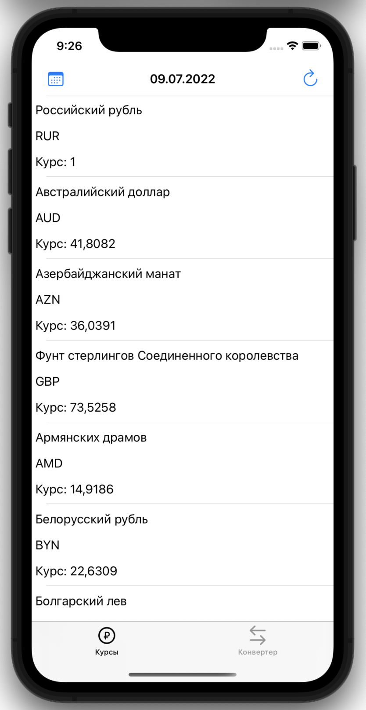
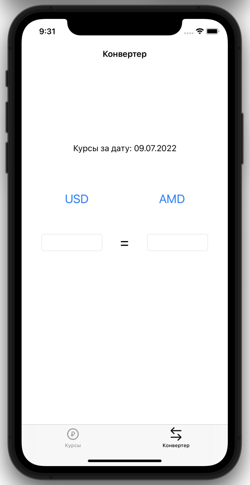
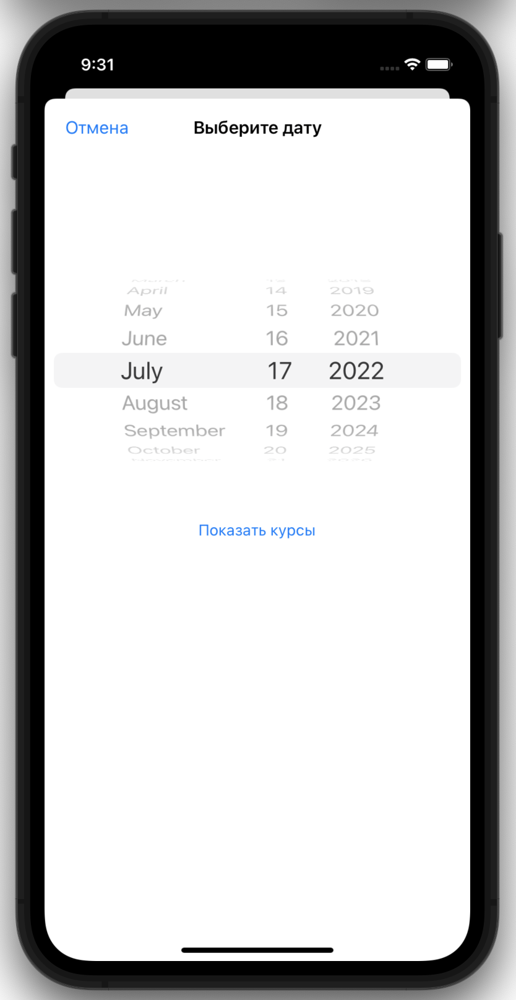

# Currency Converter

## What is this
This is my collage graduation project.
The application provides the user with a list of exchange rates for the selected date against the ruble.
The app receives data from the website of [the Central Bank of the Russian Federation](https://www.cbr.ru) in XML format and shows it to the user in a more friendly way.
Also, it allows you to calculate any currency relative to another.

 

___

## First version(Now)

The first version of the app was not written for the graduation project in the best way. 
The app is written with a storyboard and not the best design. During development, I didn't use Git.

___
## Second version

- [x] get rid of the storyboard
- [x] write interface with code
- [ ] New features?
